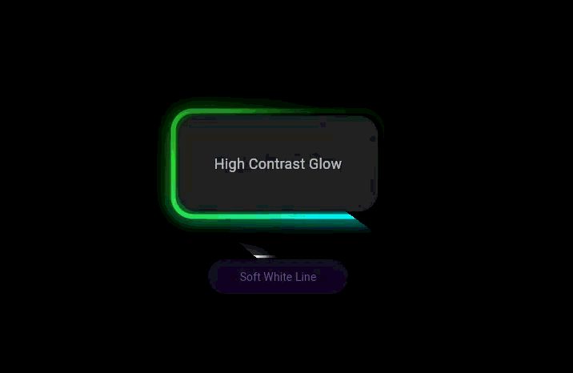

# Animated Gradient Border ✨

A Simple Flutter package that provides animated gradient borders for widgets with customizable colors, shapes, and animation controls like speed, gradient stops etc.



## Installation 💻

Just add `animated_gradient_border` to your `pubspec.yaml`:

```yaml
dependencies:
  animated_gradient_border: ^0.1.0
```

Or install it directly from the command line:

```sh
flutter pub add animated_gradient_border
```

## Usage

Import the package in your Dart file:

```dart
import 'package:animated_gradient_border/animated_gradient_border.dart';
```

## Examples

### Basic Usage

Create a simple animated gradient border around any widget:

```dart
// Example 1: Fast, highly customized border
AnimatedGradientBorder(
    borderWidth: 6,
    borderRadius: 25,
    speed: const Duration(milliseconds: 1500), // Faster rotation
    colors: const [
    Color(0xFF00FFFF), // Cyan
    Color(0xFF32CD32), // Lime Green
    Colors.transparent,
    ],
    stops: const [0.0, 0.4, 1.0], // Controls the gradient length
    child: Container(
    width: 250,
    height: 120,
    decoration: BoxDecoration(
        color: Colors.grey[900],
        borderRadius: BorderRadius.circular(25),
    ),
    child: const Center(
        child: Text(
        "High Contrast Glow",
        style: TextStyle(color: Colors.white70, fontSize: 18),
        ),
    ),
    ),
),

// Example 2: Slower, soft white glow (The original request)
AnimatedGradientBorder(
    borderWidth: 3,
    borderRadius: 30,
    speed: const Duration(milliseconds: 3500), // Slower rotation
    // Uses a soft white gradient that fades out quickly
    colors: const [
    Colors.white,
    Colors.transparent,
    Colors.transparent,
    ],
    stops: const [0.0, 0.15, 1.0], // Sharp fade to transparent
    child: ElevatedButton(
    style: ElevatedButton.styleFrom(
        backgroundColor: Colors.black,
        shape: RoundedRectangleBorder(
        borderRadius: BorderRadius.circular(30),
        ),
        padding: const EdgeInsets.symmetric(
        horizontal: 40,
        vertical: 20,
        ),
        elevation: 0,
    ),
    onPressed: () {},
    child: const Text("Soft White Line"),
    ),
),
```

## Customization

To customize the AnimatedGradientBorder we have many options:

## Parameters

The [AnimatedGradientBorder](cci:2://file:///f:/Projects/Flutter/animated_gradient_border/lib/animated_gradient_border.dart:5:0-45:1) widget supports the following customization options:

| Property       | Type                | Default Value                                            | Description                                                                  |
| -------------- | ------------------- | -------------------------------------------------------- | ---------------------------------------------------------------------------- |
| `child`        | `Widget` (required) | -                                                        | The widget to display inside the gradient border                             |
| `colors`       | `List<Color>`       | `[Colors.transparent, Colors.white, Colors.transparent]` | List of colors for the gradient loop                                         |
| `borderWidth`  | `double`            | `2.0`                                                    | Thickness of the border line                                                 |
| `borderRadius` | `double`            | `12.0`                                                   | Corner radius for the border                                                 |
| `speed`        | `Duration`          | `Duration(seconds: 2)`                                   | How fast the gradient rotates (seconds per full rotation)                    |
| `glowSigma`    | `double?`           | `null`                                                   | Controls the glow effect (set to 0 to disable)                               |
| `stops`        | `List<double>?`     | `null`                                                   | Controls the distribution of colors in the gradient (e.g.,`[0.0, 0.5, 1.0]`) |

## Running Tests 🧪

To run all unit tests, use the following command:

```sh
flutter test
```

## License

This project is licensed under the MIT License - see the LICENSE file for details.

[flutter_install_link]: https://docs.flutter.dev/get-started/install
